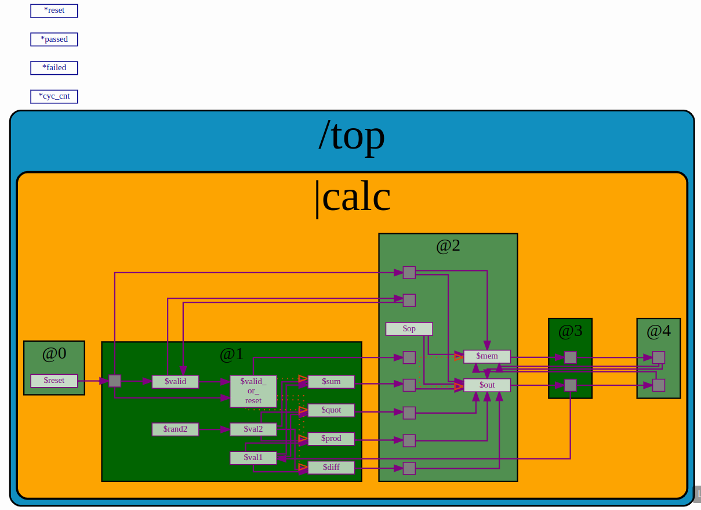
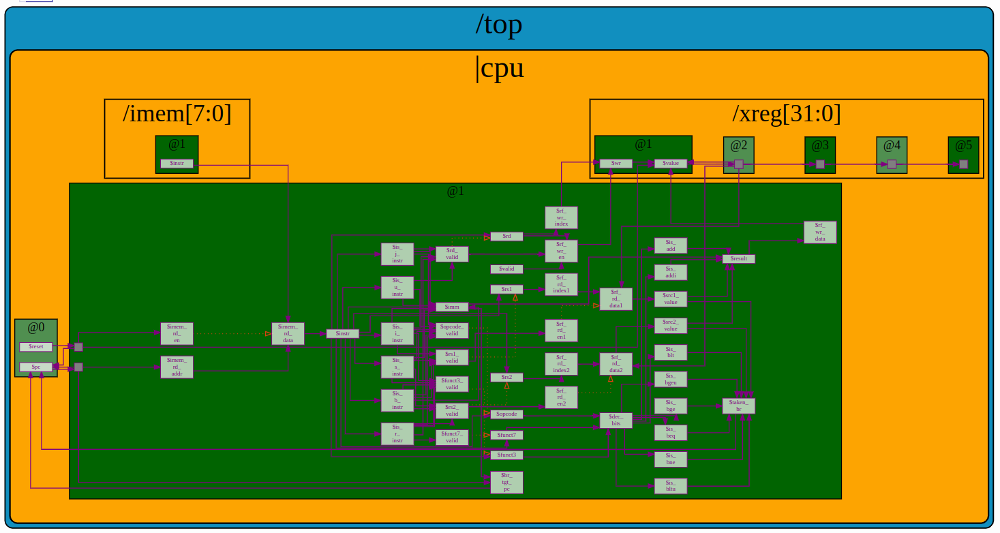

# NASSCOM RISC-V Based MYTH Program
This repository documents the work done during the RISC-V based MYTH program conducted by NASSCOM from 16/04/25 to 25/04/25.

## Day1: Introduction to RISC-V ISA and GNU compiler toolchain
In this section compiling and executing C-language as well as assembly language programs was introduced. Additionally, the usage of a debugger to efficiently debug program errors was also taught.

## Day2: Introduction to ABI and basic verification flow

## Day3: Digital Logic with TL-Verilog and Makerchip
For this assignment we had to develop a calculator that also has the features of both memory and recall in addition to performing the operations of sum, diffference, product and quotient. the schematic of the calclator designed is hwon below. To refer to the code one can either access this link [calculator code](https://www.makerchip.com/sandbox/0DkfBhR9B/048hBnP#) or the file calc_lab.tlv in the /Day3 directory.

## Day4: Basic RISC-V CPU micro-architecture

[comment]: <> (## Day5: Complete Pipelined RISC-V CPU micro-architecture)